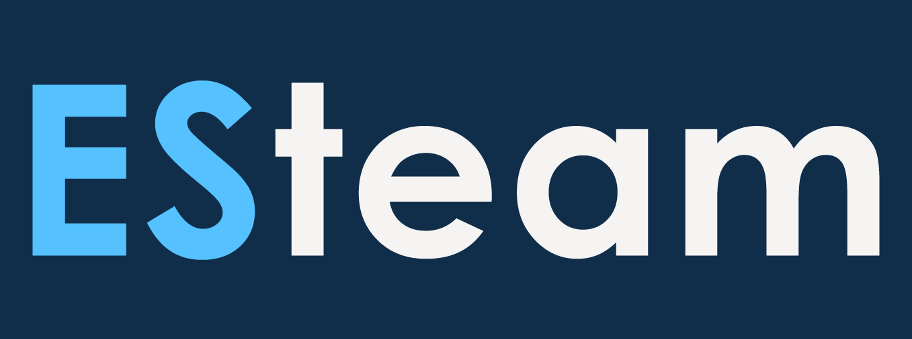

# Detector project
## Developed by ESteam
## Developed to the specifications of the Moscow pre-professional Olympiad

# Participants:
- https://github.com/Shadow318193  
    
- https://github.com/Vera152022  
    
- https://github.com/alissaryb  
    
- https://github.com/prok0l  
    
- https://github.com/ArtSharaev  
    
